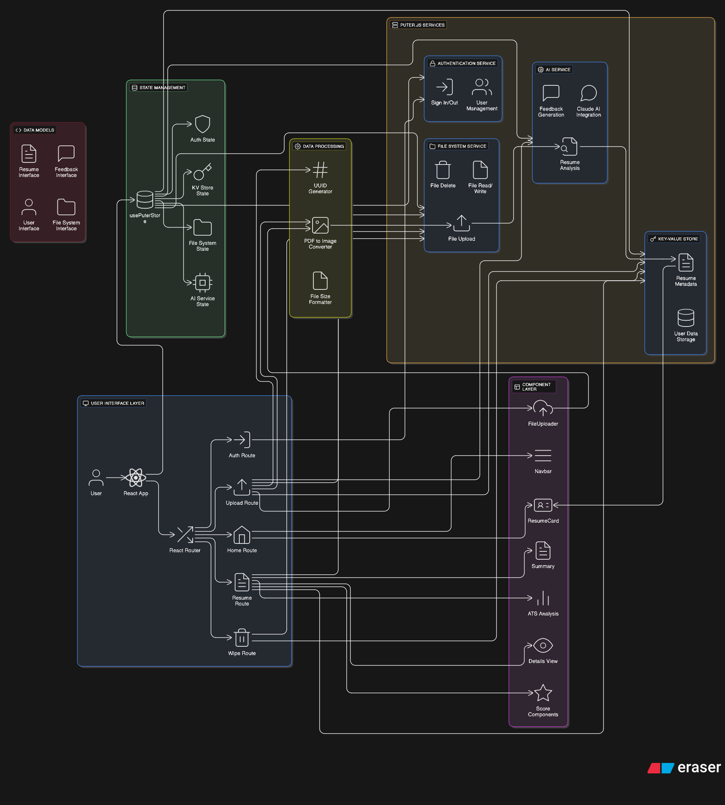

# ResuMaster - AI-Powered Resume Analyzer

## 📋 Project Overview

ResuMaster is a modern React + TypeScript web application designed to help job seekers analyze and improve their resumes using AI-powered insights. The application leverages Puter.js services for seamless integration of authentication, file management, AI-powered resume feedback, and data persistence.

Users can upload their resume PDFs, which are automatically converted to images for preview. The app provides comprehensive analysis focusing on various aspects such as **ATS compatibility**, **tone and style**, **content quality**, **structure**, and **relevant skills**.

## 🏛️ System Architecture

## ✨ Features

- **🔐 User Authentication** - Secure sign-in/sign-out with session management
- **📄 Resume Upload** - Drag-and-drop PDF upload with automatic conversion to images
- **🤖 AI-Powered Analysis** - Detailed resume feedback using Claude AI via Puter.js
- **📊 Comprehensive Scoring** - Multi-dimensional scoring system (ATS, Content, Structure, Skills, Tone)
- **💾 Data Persistence** - Store and retrieve resume feedback data
- **📱 Responsive UI** - Clean, modern interface with score visualizations
- **📈 Resume History** - Track multiple resume submissions over time
- **🧹 Data Management** - Built-in data wipe functionality for privacy

## 🛠️ Tech Stack

### Frontend
- **React 18** - Modern React with hooks and functional components
- **TypeScript** - Type-safe JavaScript for better development experience
- **Tailwind CSS** - Utility-first CSS framework for rapid UI development
- **React Router** - Client-side routing and navigation

### State Management
- **Zustand** - Lightweight state management with custom Puter.js store integration

### Backend Services (via Puter.js)
- **Authentication Service** - User management and session handling
- **File System Service** - PDF upload, storage, and retrieval
- **AI Service** - Claude AI integration for resume analysis
- **Key-Value Store** - Metadata and feedback persistence

### Additional Libraries
- **PDF.js** - PDF to image conversion
- **React Dropzone** - File upload with drag-and-drop support

## 🚀 Setup Instructions

### Prerequisites
- Node.js (v16 or higher)
- npm or yarn package manager
- Access to Puter.js services

### Installation

1. **Clone the Repository**
- git clone <repository-url>
- cd resumaster

2. **Install Dependencies**
- npm install

3. **Configure Environment**
- Ensure Puter.js is properly configured in your environment
- The app will automatically initialize Puter.js services on startup

4. **Start the Development Server**
- npm run dev

## 📖 Usage Guide

1. **Authentication**
- Click "Log In" to authenticate with Puter.js
- You'll be redirected after successful authentication

2. **Upload Resume**
- Navigate to the Upload page
- Fill in company name, job title, and job description (optional)
- Drag and drop your PDF resume or click to select
- Click "Analyze Resume" to start the AI analysis

3. **View Results**
- Review your overall score and detailed feedback
- Explore different categories: ATS, Content, Structure, Skills, Tone & Style
- Each category provides specific tips for improvement

4. **Resume History**
- View all your previously analyzed resumes on the Home page
- Click on any resume card to view detailed feedback

## 🔧 Key Components

### State Management
- **usePuterStore**: Zustand store wrapping all Puter.js services
- Handles authentication, file operations, AI interactions, and data persistence

### AI Integration  
- Uses Claude AI via Puter.js for resume analysis
- Structured prompts for consistent feedback format
- Multi-dimensional scoring system

### File Processing
- PDF.js integration for client-side PDF to image conversion
- Automatic file upload and storage via Puter.js file system

## Tech Stack 

- **Puter.js** for providing comprehensive backend services
- **Claude 3.7** for intelligent resume analysis
- **Tailwind CSS** for beautiful, responsive design
- **React** ecosystem for robust frontend development

---

**Built with ❤️ using React, TypeScript, and Puter.js**

